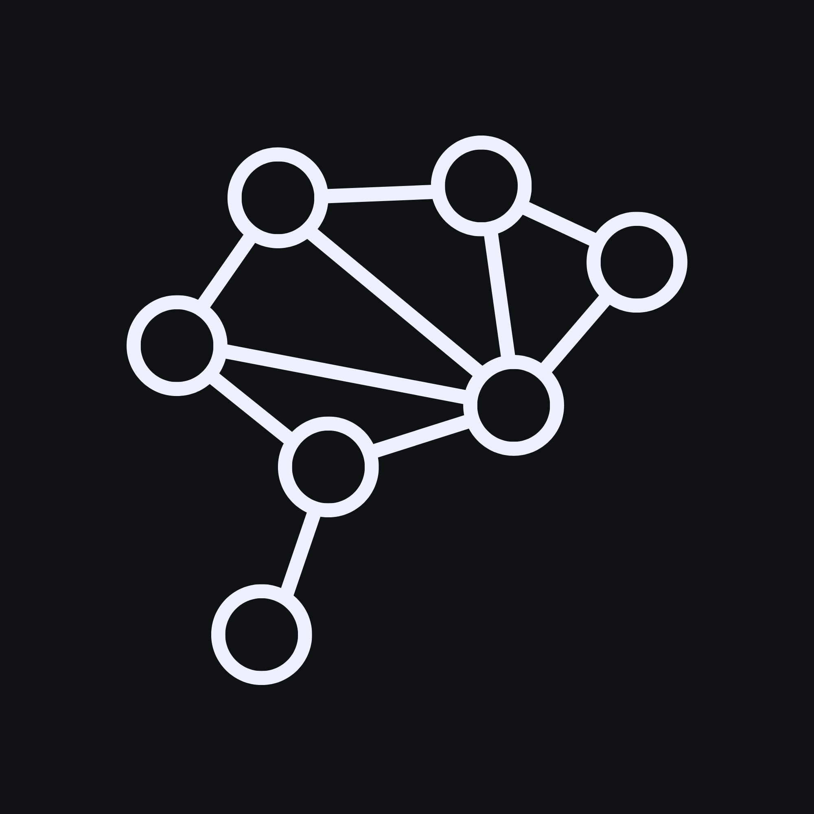
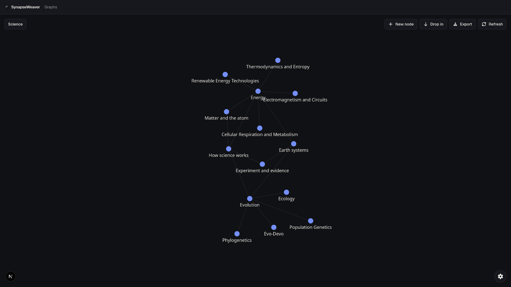

<p align="center">

</p>

# SynapseWeaver

Guided learning through a knowledge graph: discover what to learn next. 
<p align="center">

</p>
## Overview

When self-studying various topics, the lack of a precise roadmap can hinder learning. You don't know what you don't know, so you just stumble around topics.

This app uses AI to suggest you related and contextualized topics. It also lets you write notes directly on the node.

This app is inspired by [Obsidian](https://obsidian.md/) and the [Zettelkasten method](https://en.wikipedia.org/wiki/Zettelkasten)

## Architecture

| Layer | Choice |
| --- | --- |
| App | Next.js App Router (UI + API in one project) |
| UI | React, Tailwind CSS 4, `next-themes`, `react-force-graph-2d` |
| Data | PostgreSQL + pgvector, Prisma |
| Files | Vercel Blob; DB keeps only `fileUrl` |


## Setup

### Prerequisites

- Node.js 20+
- Docker (for local Postgres with pgvector)

### 1. Install

```bash
npm install
```

### 2. Environment

```bash
cp .env.example .env.local
```

`DATABASE_URL` defaults to the Docker Compose database. Create a [Blob store](https://vercel.com/docs/vercel-blob) and copy `BLOB_READ_WRITE_TOKEN` into `.env.local` for uploads and inline images.
Get a key on Google AI Studio and copy it into `GEMINI_API_KEY`. 

### 3. Database

```bash
docker compose up -d
npx prisma migrate deploy
```

And if you wish to start with some default graphs:
```bash
npx prisma db seed
```

### 4. Run

```bash
npm run dev
```

Open [http://localhost:3000](http://localhost:3000) (redirects to `/graph`).


